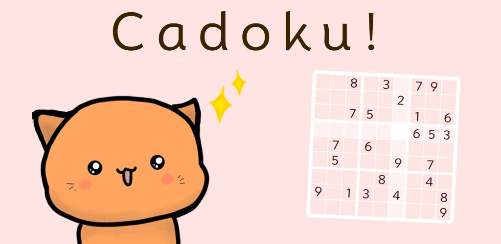
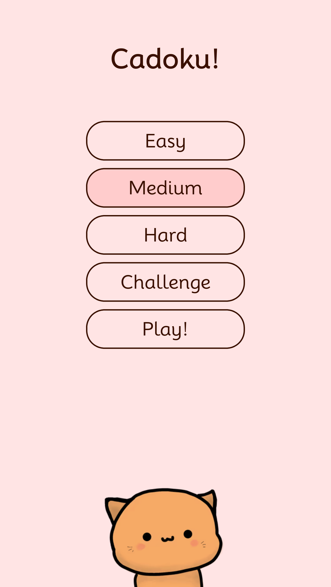
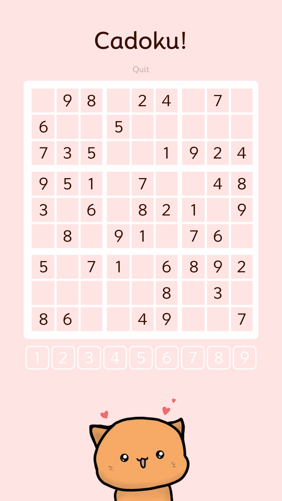
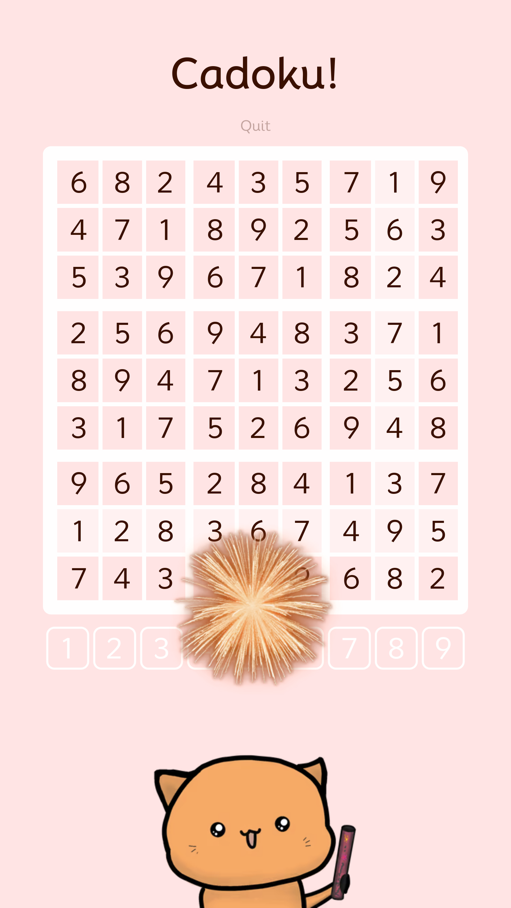

# Cadoku

A cozy, cat-themed and marshmallow-coloured Sudoku app.

The application is written in Rust using Dioxus and is available cross-platform:
- as a [Progressive Web App](https://juliankarrer.github.io/cadoku/)
- as an Android App
- or Desktop application

Progress is saved across reloads and application restarts.

Efficiently generates puzzles of varying difficulty that are guaranteed to be solvable without guessing by using recursive constraint propagation as suggested by [Peter Norvig](http://norvig.com/sudoku.html).

  

Tip: Try petting the cat to see a surprise
